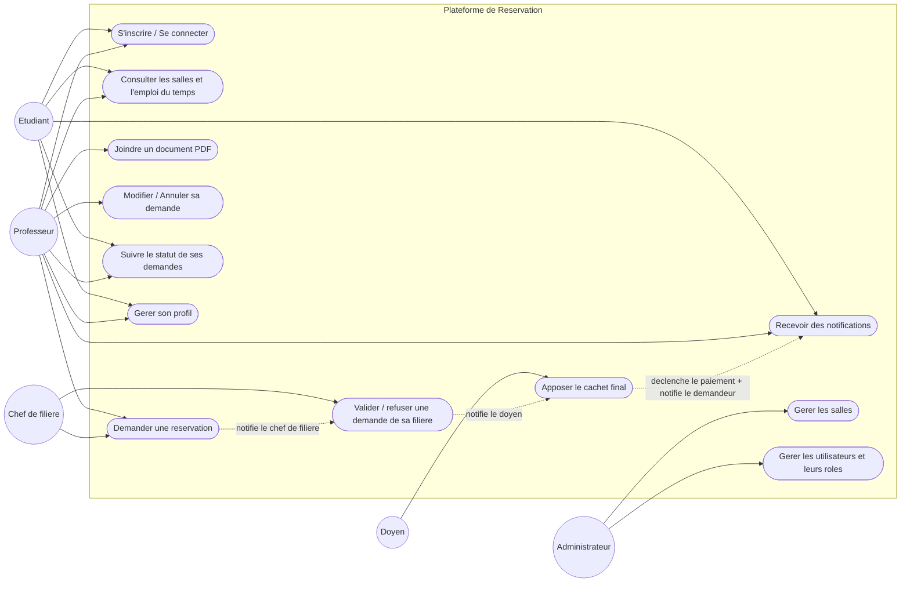
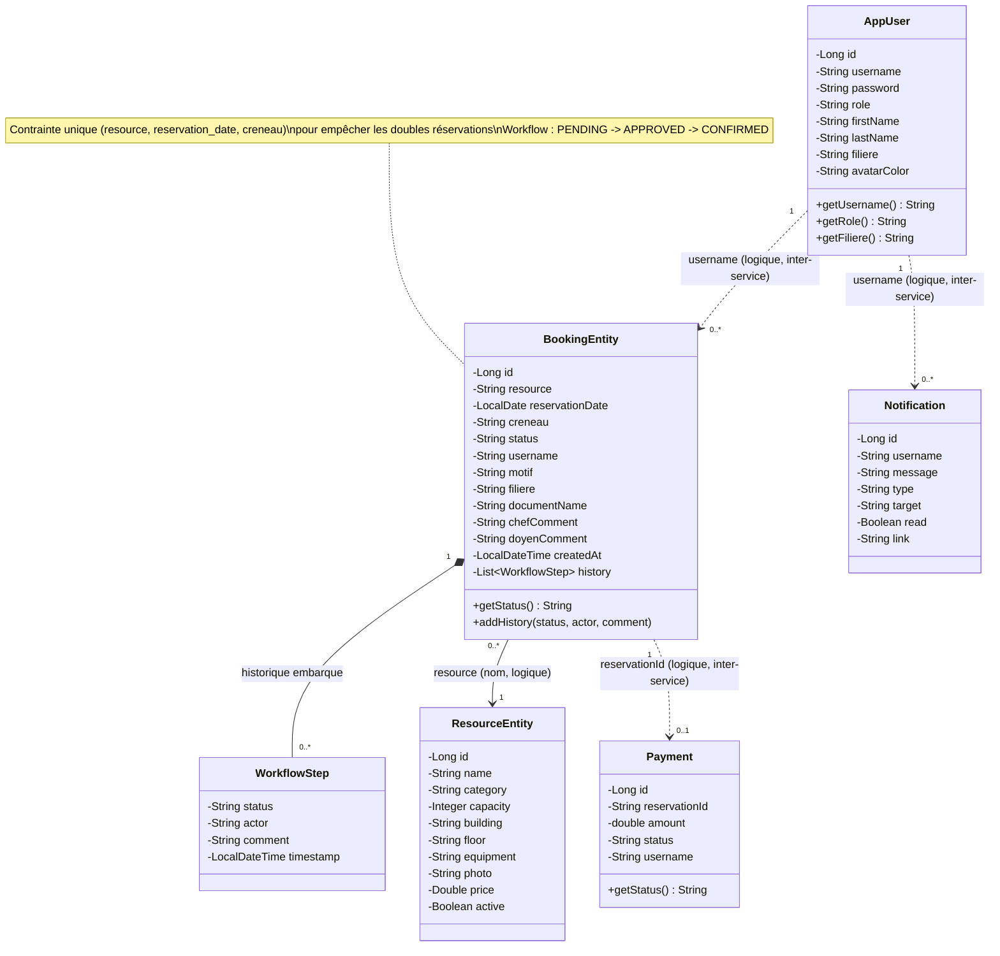
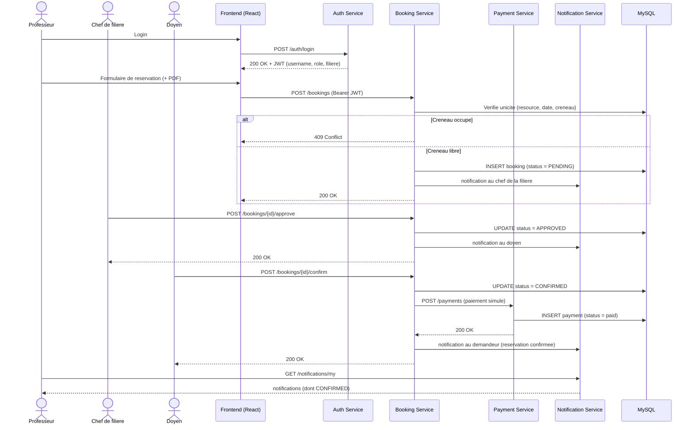
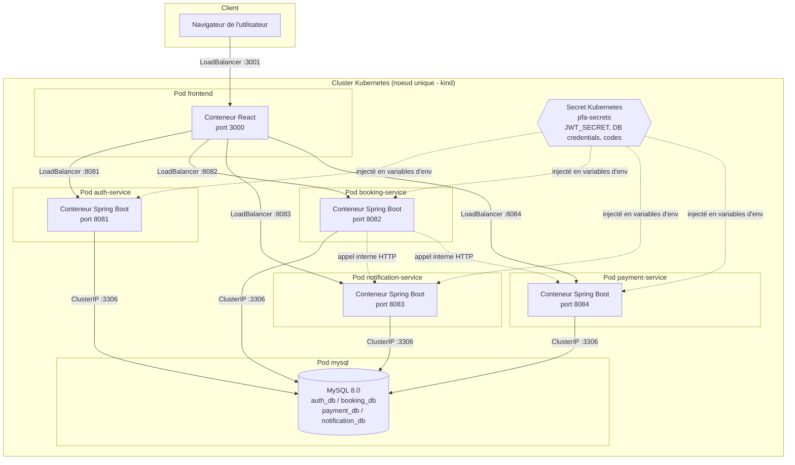

# Diagrammes UML — Plateforme de Réservation (FST Settat)

Ce document contient les 4 diagrammes UML demandés par le cahier des charges (section 4.2) :
cas d'utilisation, classes, séquence, déploiement.

Les diagrammes sont écrits en syntaxe [Mermaid](https://mermaid.js.org/). GitHub les affiche
automatiquement dans ce fichier `.md`. Pour les insérer comme images dans un rapport Word/PDF,
copie chaque bloc sur [mermaid.live](https://mermaid.live), exporte en PNG/SVG, puis colle
l'image dans le document.

---

## 1. Diagramme de cas d'utilisation

Cinq acteurs, alignés sur les rôles de l'`auth-service` : **Étudiant** (`ETUDIANT`),
**Professeur** (`PROF`), **Chef de filière** (`CHEF_FILIERE`), **Doyen** (`DOYEN`) et
**Administrateur** (`ADMIN`). L'inscription en tant que personnel (prof / chef / doyen / admin)
nécessite un code d'inscription secret.

---

## 2. Diagramme de classes

Représente les entités JPA persistées, une par microservice (chacune dans sa propre base
MySQL : `auth_db`, `booking_db`, `payment_db`, `notification_db`). Il n'y a pas de clé
étrangère technique entre elles (architecture microservices oblige — chaque service est
indépendant), mais un lien logique existe via le champ `username`, indiqué en pointillés.

---

## 3. Diagramme de séquence

Scénario complet du workflow à 3 niveaux : un **professeur** crée une demande, le **chef de
filière** la valide, le **doyen** appose le cachet final (qui déclenche le paiement simulé),
puis le demandeur est notifié à chaque étape. Reflète le flux réel implémenté dans
`MyBookingsPage.js` / `ApprovalsPage.js` / `BookingService.java`.

---

## 4. Diagramme de déploiement

Deux modes de déploiement coexistent dans le projet : **Docker Compose** (développement local)
et **Kubernetes** (orchestration testée en local via Docker Desktop / kind). Le diagramme
ci-dessous représente le déploiement Kubernetes, qui correspond à l'exigence du cahier des
charges (« Orchestrer les conteneurs avec Kubernetes »).

---

## Notes pour le rapport

- Chaque microservice possède son propre init-container `wait-for-mysql` qui attend que le
  port 3306 réponde avant de démarrer, évitant les erreurs de connexion au boot.
- La communication `booking-service → notification-service` et `booking-service → payment-service`
  illustre le couplage faible entre microservices : des appels HTTP internes via les noms de
  service Kubernetes (`http://notification-service:8083`, `http://payment-service:8084`),
  sans dépendance directe au code.
- Le contrôle de concurrence pour éviter les doubles réservations est assuré par une
  contrainte SQL unique `(resource, reservation_date, creneau)`, pas par un verrou applicatif —
  plus robuste sous charge concurrente.
- Dans la démo kind/CI, MySQL utilise le stockage éphémère du pod : les données sont
  réinitialisées à chaque redéploiement (et les seeds réappliqués). Un `PersistentVolumeClaim`
  est prévu pour un déploiement de production.
