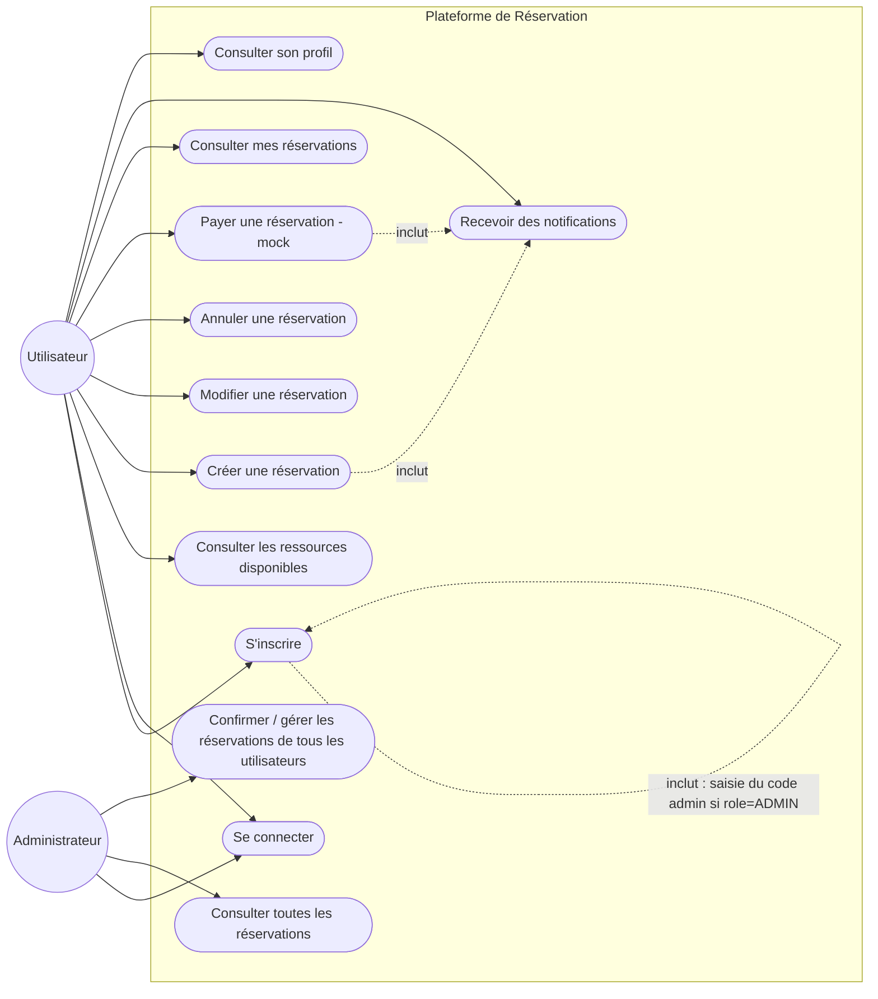
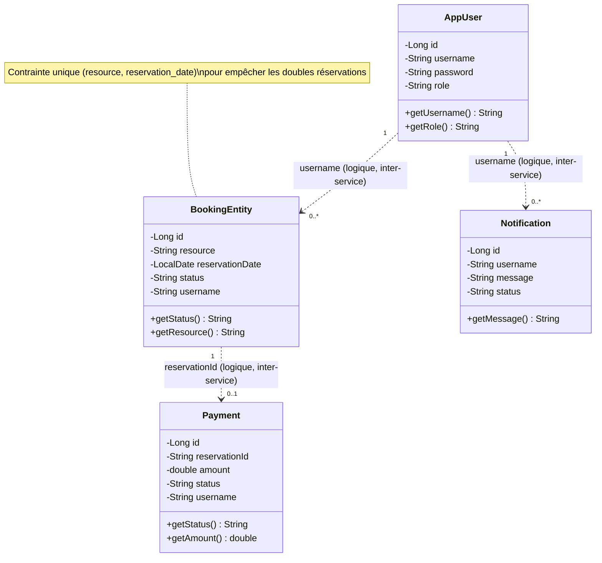
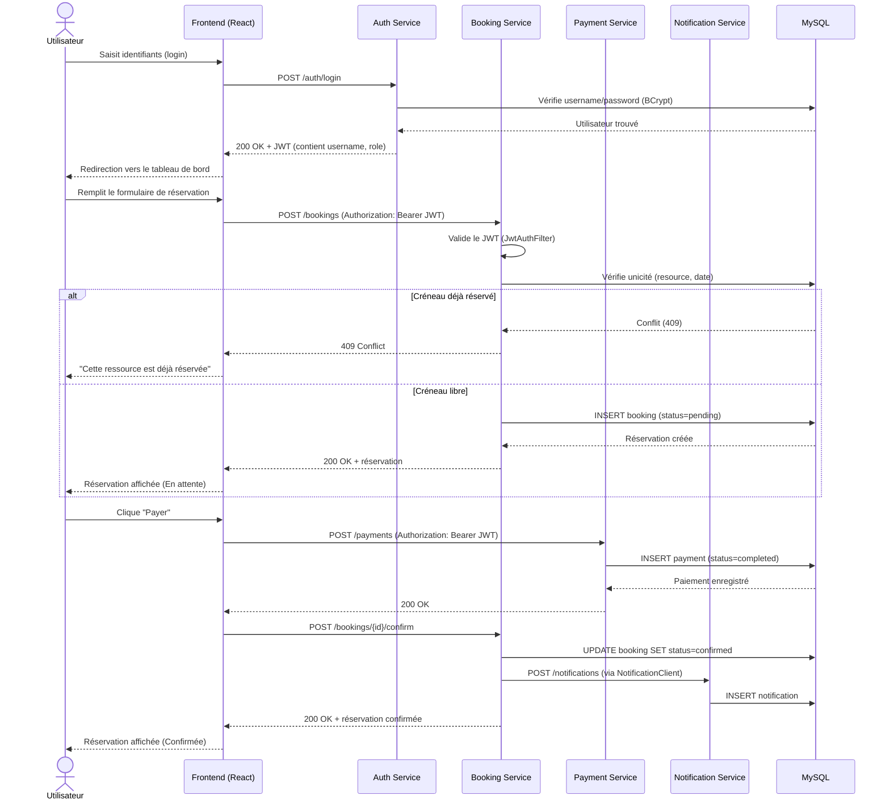
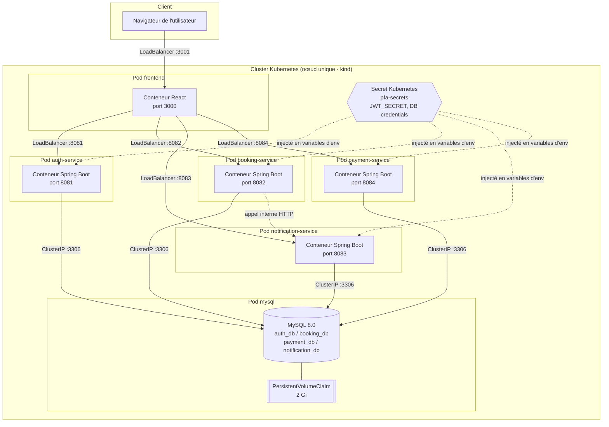

# Diagrammes UML — Plateforme de Réservation

Ce document contient les 4 diagrammes UML demandés par le cahier des charges (section 4.2) :
cas d'utilisation, classes, séquence, déploiement.

Les diagrammes sont écrits en syntaxe [Mermaid](https://mermaid.js.org/). GitHub les affiche
automatiquement dans ce fichier `.md`. Pour les insérer comme images dans un rapport Word/PDF,
copie chaque bloc sur [mermaid.live](https://mermaid.live), exporte en PNG/SVG, puis colle
l'image dans le document.

---

## 1. Diagramme de cas d'utilisation

Deux acteurs : **Utilisateur** (rôle `USER`) et **Administrateur** (rôle `ADMIN`, qui hérite
de toutes les actions de l'utilisateur). L'inscription en tant qu'administrateur nécessite un
code secret connu uniquement de l'équipe projet.

---

## 2. Diagramme de classes

Représente les 4 entités JPA persistées, une par microservice (chacune dans sa propre base
MySQL : `auth_db`, `booking_db`, `payment_db`, `notification_db`). Il n'y a pas de clé
étrangère technique entre elles (architecture microservices oblige — chaque service est
indépendant), mais un lien logique existe via le champ `username`, indiqué en pointillés.

---

## 3. Diagramme de séquence

Scénario complet : un utilisateur se connecte, crée une réservation, la paie, et elle est
confirmée avec envoi d'une notification. Reflète le flux réel implémenté dans
`MyBookingsPage.js` / `BookingController.java` / `PaymentController.java`.

---

## 4. Diagramme de déploiement

Deux modes de déploiement coexistent dans le projet : **Docker Compose** (développement local)
et **Kubernetes** (orchestration testée en local via Docker Desktop / kind). Le diagramme
ci-dessous représente le déploiement Kubernetes, qui correspond à l'exigence du cahier des
charges ("Orchestrer les conteneurs avec Kubernetes").

---

## Notes pour le rapport

- Chaque microservice possède son propre init-container `wait-for-mysql` qui attend que le
  port 3306 réponde avant de démarrer, évitant les erreurs de connexion au boot.
- La communication `booking-service → notification-service` illustre le couplage faible entre
  microservices : un appel HTTP interne via le nom de service Kubernetes
  (`http://notification-service:8083`), pas de dépendance directe au code.
- Le contrôle de concurrence pour éviter les doubles réservations est assuré par une
  contrainte SQL unique `(resource, reservation_date)`, pas par un verrou applicatif — plus
  robuste sous charge concurrente.
